<div align="center">

# 错题本 · mistake-recorder（Android）

### 拍下错题，它自己认出来、整理好、排版成能打印的 A4。

单机 Android App：**拍照 / 相册 / PDF → MinerU 解析（公式、表格、手写）→ 大模型纠错整理 → 人工编辑 → 本地错题本 → 勾选打印 A4**，还能针对每道题直接和 AI 对话讲解。

不上云、不注册账号，API Key 只存本机加密存储。

[](LICENSE)
[](https://github.com/ausyeah/mistake-recorder/actions)
[](https://github.com/ausyeah/mistake-recorder)
[](https://github.com/ausyeah/mistake-recorder)

</div>

---

## 实机截图

以下均为真实设备截图。按「配置与录入 → AI 整理 → 对话 → 打印」的使用流程分组展示。

### 配置与录入

<p align="center">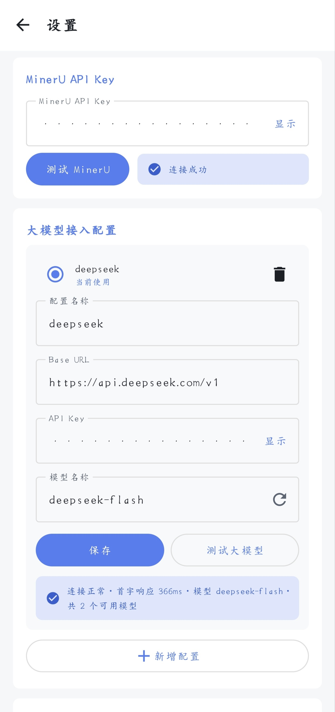</p>

<p align="center"><b>① 配置</b>：MinerU API Key 与大模型接入（DeepSeek 等兼容服务），可保存多套随时切换</p>

<p align="center">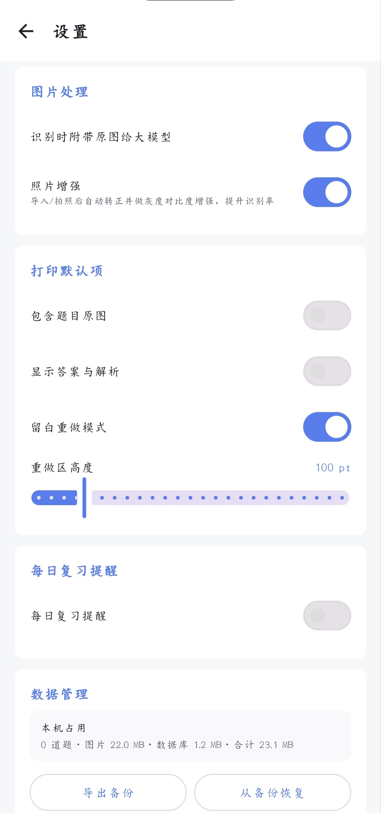</p>

<p align="center"><b>② 其他设置</b>：图片处理、打印默认项、复习提醒、备份与恢复</p>

<p align="center">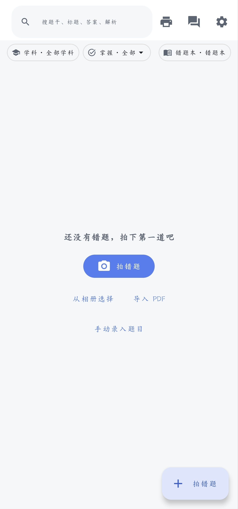</p>

<p align="center"><b>③ 主页</b>：空状态引导，右下角进入拍照 / 相册 / PDF / 手动录入</p>

<p align="center">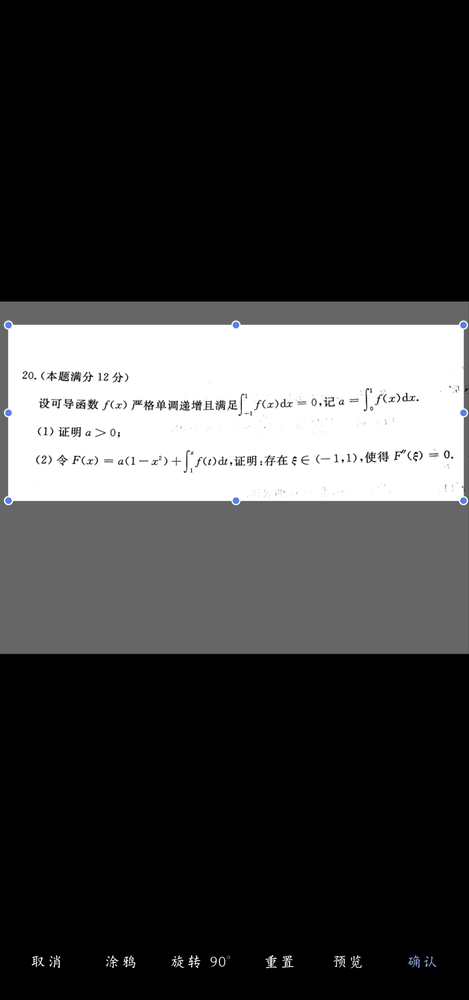</p>

<p align="center"><b>④ 裁切</b>：拖框选题目、框外压暗、涂鸦遮蔽排除页面噪声</p>

<p align="center">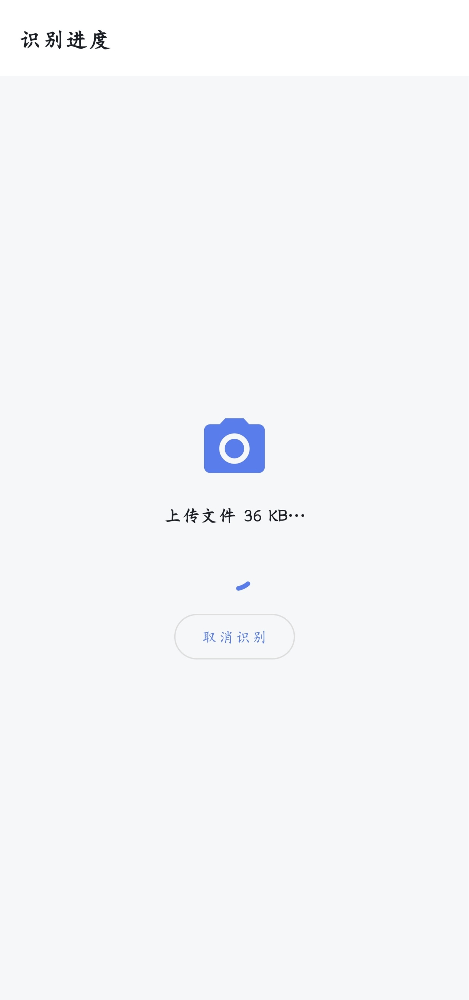</p>

<p align="center">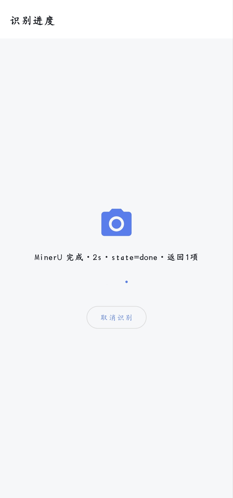</p>

<p align="center">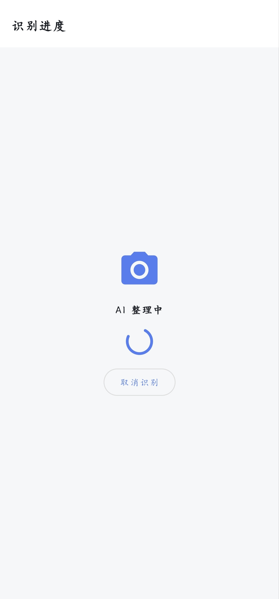</p>

<p align="center"><b>⑤ 上传处理过程</b>：上传 → MinerU 解析 → AI 整理，阶段来自数据库，失败可重试</p>

<p align="center">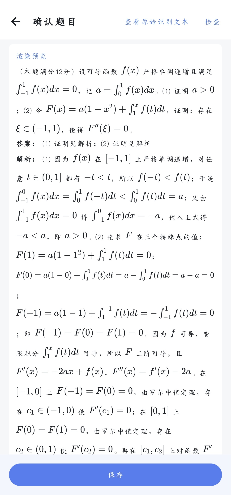</p>

<p align="center">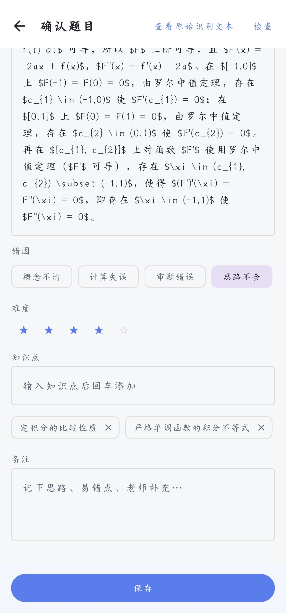</p>

<p align="center"><b>⑥ 识别结束产物与编辑页</b>：核对整理结果、补知识点 / 错因 / 难度，确认后入库</p>

<p align="center">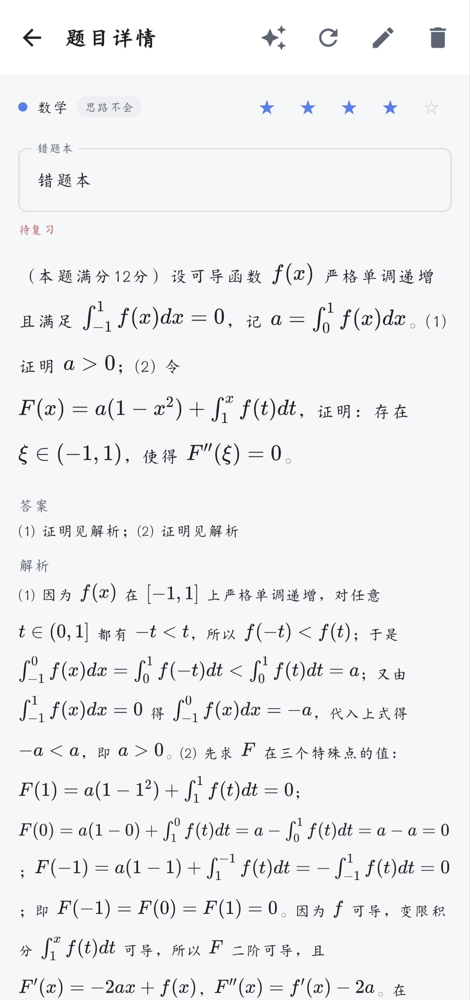</p>

<p align="center"><b>⑦ 题目详情</b>：题干 / 答案 / 解析对照，标记已掌握、点星改难度</p>

<p align="center">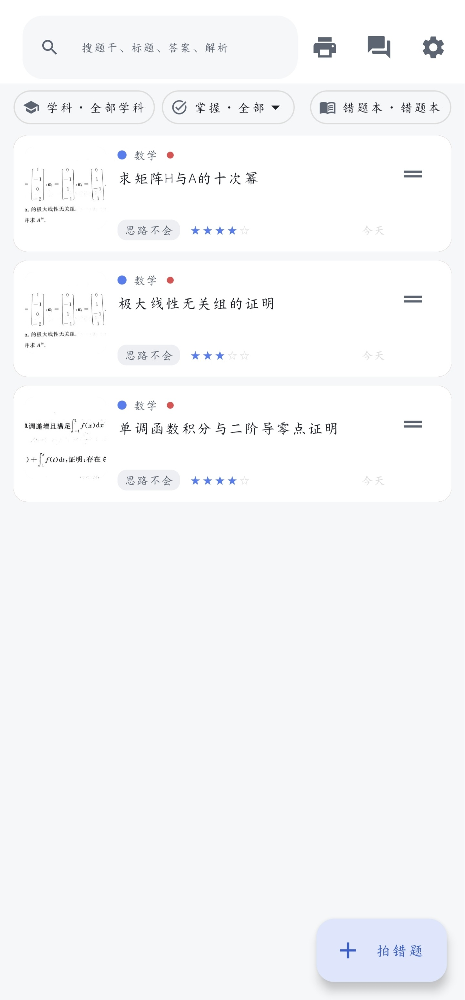</p>

<p align="center"><b>⑧ 主页题目排布</b>：按学科 / 掌握状态筛选，搜索、左滑删除可撤销</p>

### AI 对话

<p align="center">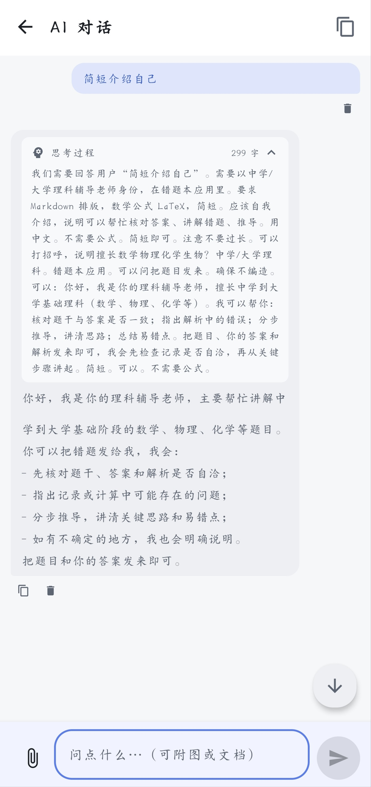</p>

<p align="center"><b>⑨ 题目 AI 对话</b>：流式回复，可附图片 / PDF / TXT / Markdown / DOCX</p>

<p align="center">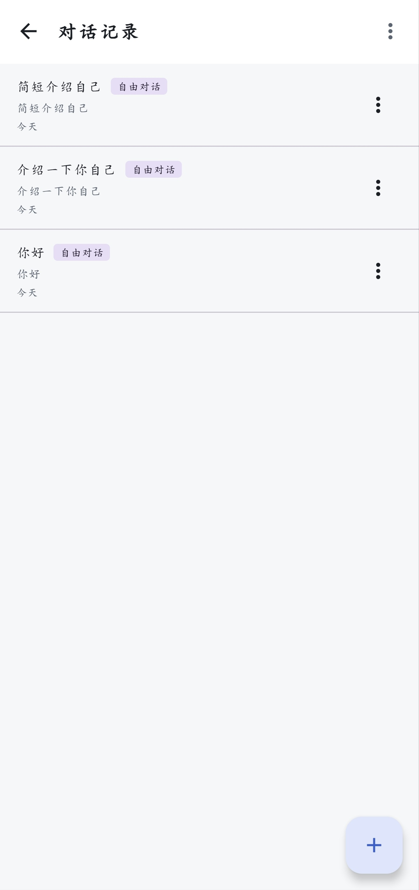</p>

<p align="center"><b>⑩ AI 对话记录</b>：每题一个固定会话 + 自由会话</p>

### 打印与 PDF

<p align="center">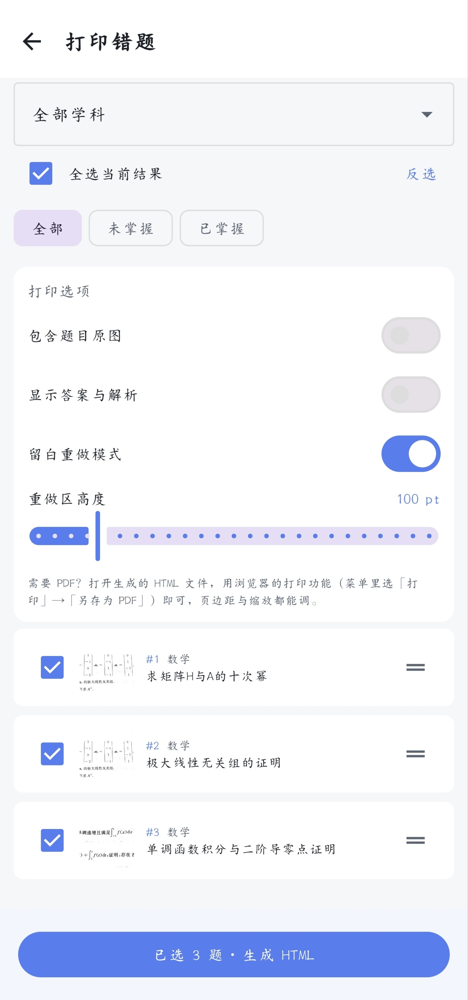</p>

<p align="center"><b>⑪ 打印选项</b>：勾选题目，可选含原图 / 显示答案解析 / 留白重做</p>

<p align="center">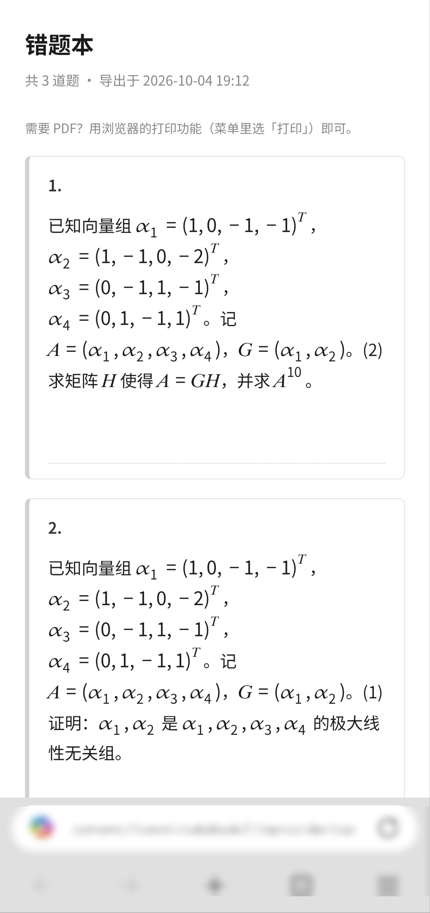</p>

<p align="center"><b>⑫ 浏览器预览</b>：生成自包含 HTML，浏览器打开即见排版效果</p>

<p align="center">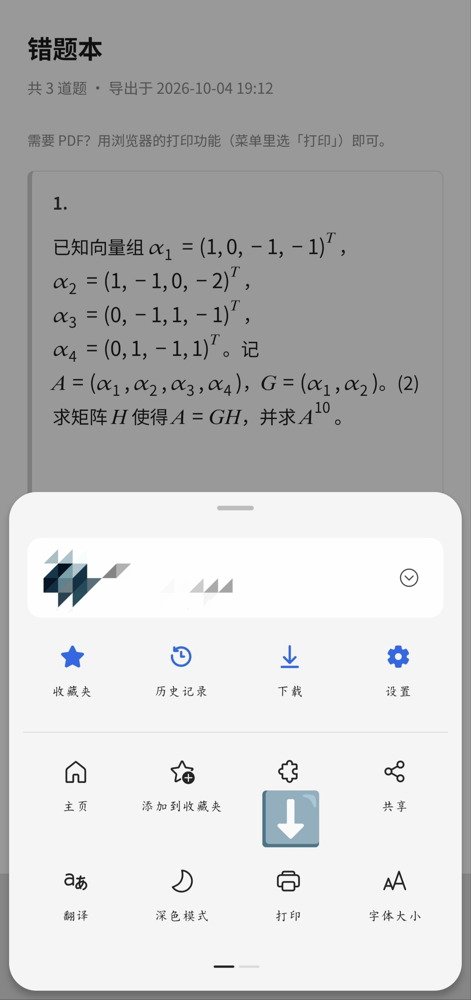</p>

<p align="center">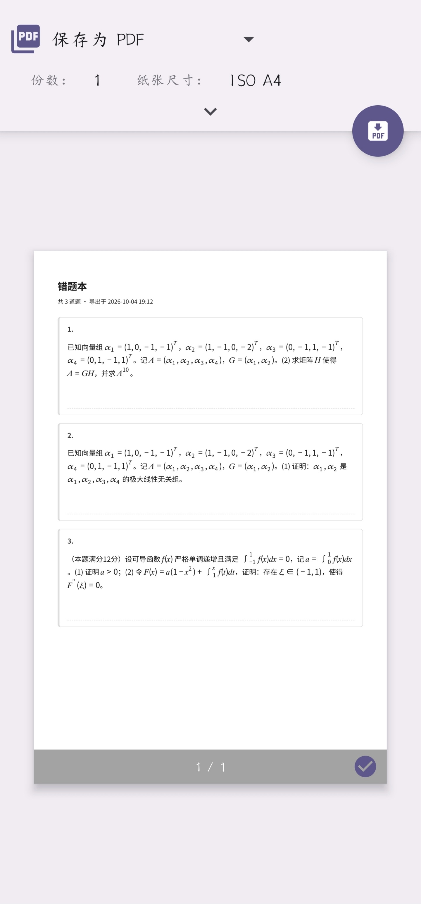</p>

<p align="center"><b>⑬ 打印操作</b>：菜单 → 打印 → 页面边距 / 缩放可调 → 另存为 PDF</p>

<p align="center">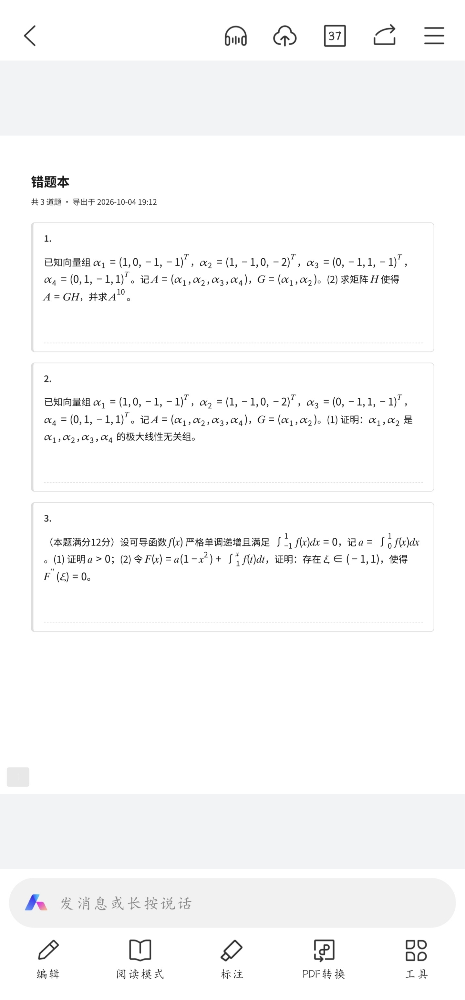</p>

<p align="center"><b>⑭ 最终 PDF</b>：A4 排版，公式 / 表格 / 题号完整呈现</p>

---

## 使用教程

### 首次配置：两个密钥

App 依赖两个**由使用者自行申请**的云 API，全部在「设置」页配置，只存本机：

1. **MinerU API Key**：用于错题图片识别。在 MinerU 开放平台申请后填入。
2. **大模型接入**：用于纠错整理与 AI 对话。填 **Base URL + API Key + 模型名**（可保存多套配置并切换，点「获取模型列表」可自动带出可选模型）。任何 OpenAI 兼容服务均可，例如 `https://api.deepseek.com` + `deepseek-chat`。

> **没有 Key 也能用**：首页「手动录入题目」完全离线，不发起任何请求。

### 日常使用流程

1. **录入**：首页右下角「拍错题」→ 拍照 / 相册 / PDF / 手动录入四选一；
2. **识别**：进度页展示 上传 → MinerU 解析 → AI 整理 三个阶段，失败可重试，或「跳过 AI 直接用原始文本」；
3. **编辑**：核对整理结果，翻页查看多题，插图可剔除，确认后入库；
4. **复习**：列表页筛选 / 搜索，左滑删除可撤销；详情页标记已掌握、点星改难度；每日待复习提醒；
5. **打印**：右上角打印机图标 → 勾选题目 → 生成 HTML（浏览器打开 → 打印 → 另存为 PDF，可调页边距与缩放）；
6. **问 AI**：详情页右上角进入该题对话（首问预填「请讲解这道题…」不自动发送），或首页右上角进入历史会话。

### API 规格

#### 一、MinerU 识别 API（v4）

- **Base URL**：`https://mineru.net/api/v4/`
- **认证**：请求头 `Authorization: Bearer <API Key>`（上传与下载走预签名 URL，**不带**认证头）
- **必需参数**：`files`（文件名列表）、`model_version`、`language`；可选 `enable_formula`、`enable_table`
- **响应信封**：`{ "code": 0, "msg": "", "data": {...} }`，`code == 0` 为成功，否则 `msg` 为错误说明

四步流程：

1. **申请上传地址**
   `POST file-urls/batch`
   ```json
   { "files": [ { "name": "错题.jpg", "is_ocr": true } ],
     "model_version": "v20240914", "language": "ch",
     "enable_formula": true, "enable_table": true }
   ```
   → `data`: `{ "batch_id": "...", "file_urls": ["https://.../presigned-url"] }`

2. **上传文件**：`PUT <file_url>`，body 为文件原始字节（无需认证头）。

3. **轮询解析结果**
   `GET extract-results/batch/{batch_id}`
   → `data.extract_result[]`：
   ```json
   { "file_name": "错题.jpg",
     "state": "done",
     "extract_progress": { "extracted_pages": 1, "total_pages": 2 },
     "full_zip_url": "https://.../result.zip",
     "err_msg": null }
   ```
   `state` 为解析状态，`extract_progress` 是**对象**（页数，非 0-100 标量）。`batch_id` 传 `"ping"` 可用于测试 Key 是否有效。

4. **下载结果**：`GET <full_zip_url>` 获取 zip（内含 Markdown 等解析产物）。

- **错误处理**：信封 `code != 0` 或单项 `err_msg` 非空表示失败；轮询失败可重试，或跳过 AI 直接手动编辑原始文本。

#### 二、大模型 API（OpenAI 兼容）

- **Base URL**：设置页配置，代码按 `{base}/chat/completions` 与 `{base}/models` 拼接（自动去尾部 `/`）
- **认证**：`Authorization: Bearer <API Key>`
- **必需参数**：`model`、`messages`（`role` + `content`，支持 `text` / `image_url` 多模态片段）；可选 `temperature`、`max_tokens`、`stream`
- **对话参数**：`temperature = 0.6`，`max_tokens = 16384`（撞上限时界面挂「已截断」标记，不会静默残缺）

**流式请求（默认）**

```
POST {base}/chat/completions
Accept: text/event-stream
{
  "model": "deepseek-chat",
  "messages": [ { "role": "user", "content": "请讲解这道题" } ],
  "temperature": 0.6,
  "max_tokens": 16384,
  "stream": true
}
```

SSE 逐帧响应（`data: {...}`）：

```json
{ "choices": [ { "delta": { "content": "增量正文", "reasoning_content": "增量思考" }, "finish_reason": null } ] }
```

- `delta.content`：正文增量；`delta.reasoning_content`：思考过程增量（推理模型）
- **结束信号**（三选一）：`finish_reason` 非空（`stop` 正常 / `length` 截断）、哨兵 `data: [DONE]`、连接关闭

**非流式响应（`stream: false`，或服务端忽略 `stream` 时自动降级）**

```json
{ "choices": [ { "message": { "content": "全文", "reasoning_content": "思考" },
                 "finish_reason": "stop" } ],
  "usage": { "prompt_tokens": 123, "completion_tokens": 456 } }
```

**错误处理约定**

| 场景 | 行为 |
|---|---|
| HTTP 401 / 403（鉴权失败） | 直接报错，不重试 |
| HTTP 429（限流）/ 5xx（服务端错误） | 直接报错，不重试（重发只会白烧配额） |
| 网络不通 / 超时 / 响应不是合法 SSE | 若**尚未吐出任何内容**，自动降级为非流式请求重试一次 |
| 已吐过内容后失败 | 不重发（避免同一段话出现两遍） |
| 用户主动停止 | 不重发，保留已收到内容 |
| `finish_reason = length` | 判定为被 `max_tokens` 截断，界面提示换更大模型或分次问 |

**附件处理**：图片压缩后转 data URL 内联进消息；PDF / TXT / Markdown / DOCX 在**本地抽取文本**拼进提问，原文件不上传。

---

## 项目结构

```
app/src/main/java/com/mistakebook/
├── data/        # Room 实体与 DAO、DataStore、备份、聊天上下文
├── di/          # 手写依赖容器
├── domain/      # 掌握状态等业务模型
├── net/         # MinerU / 大模型（SSE 流式）客户端
├── pipeline/    # 识别流水线、Latex 修复、文本审计
├── print/       # 导出（HTML 排版、字号算法）
├── review/      # 复习调度
└── ui/          # 14 个屏幕级子模块（Compose）
```

技术规格详见 [PRD.md](PRD.md)。

---

## 数据与安全

- **不预置任何 API Key**：`buildConfigField` 注入的字符串会明文落在 DEX，所以公开安装包一律注入占位符，由使用者自行填写；
- **Key 只存本机**：`EncryptedSharedPreferences`，不进日志、不随应用上传；
- 本仓库无密钥文件：`local.properties` / `keystore.properties` 等已被 `.gitignore` 拦截，仓库内只有占位模板。

## 维护者：正式签名发布

正式签名让 Release 之间的升级可以**直接覆盖安装**（不用卸载、不丢数据）。
签名密钥本体永不进仓库，只以 base64 存在仓库的 GitHub Secrets 里，CI 构建时还原。

### 一次性配置（仓库 Settings → Secrets and variables → Actions）

| Secret 名 | 内容 |
|---|---|
| `RELEASE_KEYSTORE_B64` | 发布 keystore 文件的 base64 |
| `RELEASE_STORE_PASSWORD` | keystore 口令 |
| `RELEASE_KEY_ALIAS` | 密钥别名 |
| `RELEASE_KEY_PASSWORD` | 密钥口令 |

生成 base64（Windows PowerShell）：

```powershell
[Convert]::ToBase64String([IO.File]::ReadAllBytes('C:\path\to\release.jks'))
```

### 发版（打 tag 即出签名包）

```powershell
powershell -ExecutionPolicy Bypass -File scripts\release.ps1 -Tag "v0.0.2"
```

无需任何本地构建——CI 会自动：还原密钥 → `assembleRelease` 签名 → 校验签名
与 `signing/expected-cert-sha256.txt` 记录一致 → 扫描 APK 无 Key → 挂到 Release。

> 没配 Secrets 也不会让 CI 变红：此时降级为无签名 debug 包（仅试用、升级需卸载）。
> fork 与 PR 走同样降级路径，任何贡献者都能本地构建。

## 本地编译与测试

```bash
./gradlew assembleDebug                  # 构建（本地 local.properties 有 Key 时注入，仅限本机）
./gradlew testDebugUnitTest              # 运行单元测试（450+ 用例）
```

## 许可证

[MIT](LICENSE)。随包分发的第三方组件（KaTeX 及其字体，MIT）见 [THIRD_PARTY_LICENSES.md](THIRD_PARTY_LICENSES.md)。

## 免责声明

本项目仅提供客户端能力，MinerU 与大模型 API 均为第三方服务，账号注册、配额与费用由使用者自行承担；请在使用前阅读并遵守相应服务条款。
